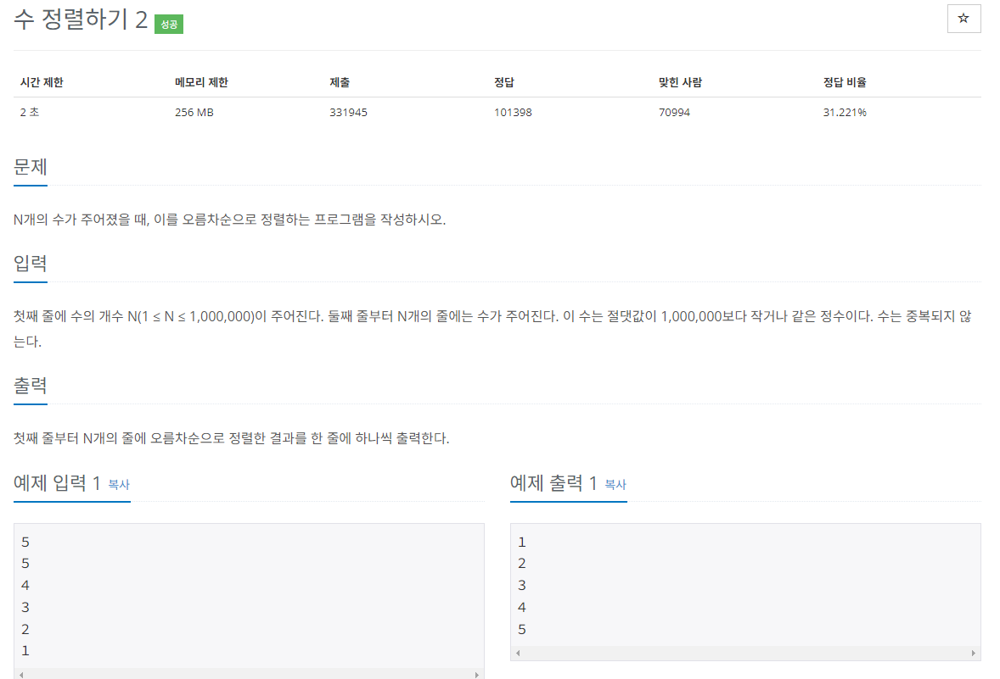
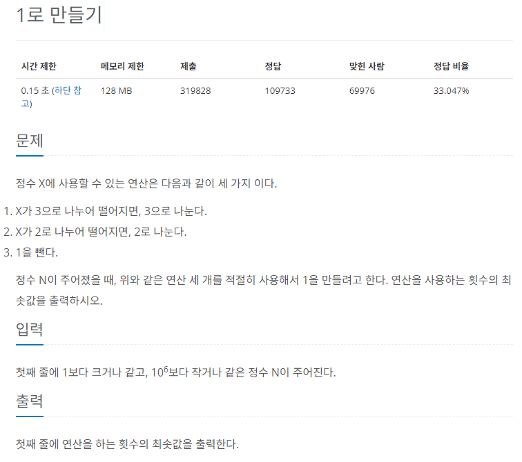
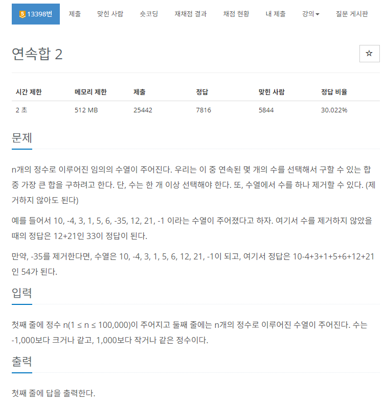

# 시간 복잡도 + 다이나믹 프로그래밍

알고리즘에서 시간복잡도는 `연산 횟수`를 의미

일반적으로 `1초 = 1억 번` 의 연산을 의미

### 시간 복잡도 유형

**빅 오메가(Ω(n)) : 최선일 때(best case)의 연산 횟수를 나타낸 표기법**

**빅 세타(θ(n)) : 보통일 때(average case)의 연산 횟수를 나타낸 표기법**

**빅 오(O(n)) : 최악일 때(worst case)의 연산 횟수를 나타낸 표기법**

```java
public class timeComplexityExample1 {
	public static void main(String[] args){
		// 1~99 사이 값 랜덤 선택
		int findNumber = (int)(Math.random() * 100);
		for(int i=0; i<100; i++){
			if(i==findNumber){
				System.out.println(i);
				break;
			}
		}
	}
}
```

### 0~99 사이의 무작위 값을 찾는 위의 예시 코드를 기준으로 보는 시간 복잡도

- **빅 오메가(Ω(n))는 1 (바로 찾은 경우가 최선의 선택)**
- **빅 세타(θ(n))는 n/2 ( 최악과 최선의 중간)**
- **빅 오(O(n)) 는 n (맨 마지막에 찾은 경우)**

## 코딩 테스트에서 사용하는 시간 복잡도 유형

코딩 테스트에서는 빅-오(O(n))을 기준으로 수행 시간을 계산하는 것이 좋다

실제 코딩테스트에서는 1개의 테스트 케이스로 합격, 불합격을 결정하지 않고, 다양한 테스트 케이스로 테스트함으로 시간 복잡도를 판단할 때는 최악일 때(O(n))를 염두에 둬야 한다

### N의 크기에 따른 O(n)의 시간 복잡도


- **O(1)**: 상수 시간. 입력 크기와 관계없이 일정한 실행 시간을 가진다
- **O(log n)**: 로그 시간. 입력 크기의 로그에 비례하는 실행 시간을 가진다
- **O(n)**: 선형 시간. 입력 크기에 비례하는 실행 시간을 가진다
- **O(n log n)**: 선형로그 시간. 입력 크기의 로그에 비례하는 값과 곱으로 실행 시간을 가진다. 예를 들어, 많은 정렬 알고리즘이 이 시간 복잡도를 가진다
- **O(n^2)**, **O(n^3)** 등: 다항 시간. 입력 크기의 제곱, 세제곱 등으로 실행 시간이 증가한다
- **O(2^n)**: 지수 시간. 입력 크기의 지수에 비례하는 실행 시간을 가진다. 매우 큰 입력에 대해 비효율적이다
- **O(n!)**: 팩토리얼 시간. 입력 크기의 팩토리얼에 비례하는 실행 시간을 가진다. 매우 큰 입력에 대해 매우 느리다

O(n^2). 즉 다항 시간부터는 기하급수적으로 시간 복잡도가 증가하는 모습을 볼 수 있음

### 시간 복잡도를 줄일 수 있는 방법

1. 수학적 개념을 적용한 복잡도 줄이기
2. 알고리즘 선택에 따른 시간 복잡도
3. 메모이제이션(Memoization) 또는 다이나믹 프로그래밍(Dynamic Programming): 계산된 값을 저장해 두고 다시 사용함으로써 중복 계산을 피함. 특히 동적 계획법(DP) 문제에서 유용합니다

## 알고리즘 선택의 기준으로 사용

버블 정렬과 병합 정렬의 시간 복잡도가 각각 O(n^2), O(nlongn)임을 생각하고 문제 예시 진행



수 정렬하기 (https://www.acmicpc.net/problem/2750)

`시간 제한이 1초`이므로 이 조건을 만족하려면 `1억 번 이하의 연산 횟수`로 문제를 해결해야 함

- 연산 횟수는 1초에 1억 번 연산하는 것을 기준으로 생각
  - 연산 횟수 = 알고리즘 시간 복잡도 X 데이터의 크기
- 시간 복잡도는 항상 최악일 때, 즉 데이터의 크기가 가장 클 때를 기준으로 테스트

위 연산 횟수를 기준으로 계산을 해보면

- 버블 정렬 : O(n^2) = (1,000,000)^2 = 1,000,000,000,000 > 200,000,000 → 부적절
- 병합 정렬 : O(nlog(n)) = 1,000,000\*log(1,000,000) = 약 20,000,000 < 200,000,000 → 적절

위의 문제의 시간 제한은 2초이므로 2억 번의 연산 횟수 안에 답을 구해야 한다

버블 정렬은 약 10억 번의 연산 횟수가 필요하므로 이 문제를 풀기에 적합하지 못한 알고리즘임을 판단할 수 있다

반면, 병합 정렬은 약 2,000만 번의 연산 횟수로 답을 구할 수 있으므로 문제를 풀기에 적합한 알고리즘이라고 판단할 수 있다

### 시간 복잡도를 바탕으로 코드 로직 개선하기

시간 복잡도는 작성한 코드의 비효율적인 로직을 개선하는 바탕으로 사용할 수 있다

시간 복잡도를 활용하기 위해서는 시간 복잡도를 먼저 도출해야 한다

시간 복잡도를 도출하는 기준

1. 상수는 시간 복잡도 계산에서 제외
2. 가장 많이 중첩된 반복문의 수행 횟수가 시간 복잡도의 기준이 된다
   1. 한 코드에 O(n^2)의 반복문과 O(n)의 반복문이 존재한다면 O(n^2)을 기준으로 한다

```java
1. 상수는 시간 복잡도 계산에서 제외

// 연산 횟수가 N인 경우
public class 시간복잡도_판별원리1 {
	public static void main(String[] args){
		int N = 100000;
		int cnt = 0;
		for(int i=0; i < N; i++){
			System.out.println("연산 횟수:" + cnt++);
		}
	}
}

// 연산 횟수가 3N인 경우
public class 시간복잡도_판별원리2 {
	public static void main(String[] args){
		int N = 100000;
		int cnt = 0;
		for(int i=0; i < N; i++){
			System.out.println("연산 횟수:" + cnt++);
		}
		for(int i=0; i < N; i++){
			System.out.println("연산 횟수:" + cnt++);
		}
		for(int i=0; i < N; i++){
			System.out.println("연산 횟수:" + cnt++);
		}
	}
}
```

위에 두 예제 코드의 연산 횟수는 3배의 차이가 발생함

큰 차이처럼 느껴지지만 코딩 테스트에서는 일반적으로 상수를 무시하고 진행

따라서 두 코드 모두 시간 복잡도가 O(N)인 코드이다

```java
2. 가장 많이 중첩된 반복문의 수행 횟수가 시간 복잡도의 기준이 된다

public class 시간복잡도_판별원리3 {
	public static void main(String[] args){
		int N = 100000;
		int cnt = 0;
		for (int i = 0; i < N; i++){
			for(int j = 0; j < N; j++){
				System.out.println("연산 횟수:" + cnt);
			}
		}

		for(int j = 0; j < N; j++){
				System.out.println("연산 횟수:" + cnt);
		}
	}
}
```

위에 예제 코드에서 O(n^2)의 반복문과 O(n)의 반복문이 존재하고 있음

하지만 시간 복잡도는 가장 많이 중첩된 반복문을 기준으로 도출하므로 이 코드에서는 이중 for문이 전체 코드의 시간 복잡도의 기준이 된다

따라서 크기가 N인 반복문이 더 추가 되어도 이 코드의 시간 복잡도는 O(N^2)이다

## 동적 계획법 (Dynamic Programming)

동적 계획법은 복잡한 문제를 여러 개의 간단한 문제로 분리하여 부분의 문제들을 해결하여 최종적으로 복잡한 문제의 답을 구하는 방법을 뜻함

### 동적 계획법의 핵심 이론과 구현 방식

1. 큰 문제를 작은 문제로 나눌 수 있어야 한다
2. 작은 문제들이 반복돼 나타나고 사용되며 이 작은 문제들의 결괏값은 항상 같아야 한다
3. 모든 작은 문제들은 한 번만 계산해 DP 테이블에 저장하며 추후 재사용할 때는 이 DP 테이블을 이용한다
4. 동적 계획법은 top-down 방식과 bottom-up방식으로 구현될 수 있다

> 피보나치 수열 공식

1. 동적 계획법으로 풀 수 있는지 확인하기
   1. 6번째 피보나치 수열은 5번째 피보나치 수열과 4번째 피보나치 수열의 합이다. 즉, 6번째 피보나치 수열을 구하는 문제는 5번째 피보나치 수열과 4번째 피보나치 수열을 구하는 작은 문제로 나눌 수 있고, 수열의 값은 항상 같기 때문에 동적 계획법으로 풀 수 있다
2. 점화식 세우기
   1. 논리적으로 전체 문제를 나누고, 전체 문제와 부분 문제 간의 인과 관계를 파악해야 한다
   2. 피보나치 수열의 점화식은 `D[N] = D[N-1] + D[N-2]` 이다
3. 메모이제이션 원리
   1. 메모이제이션은 부분 문제를 풀었을 때 이 문제를 DP테이블에 저장해 놓고 다음에 같은 문제가 나왔을 때 재계산하지 않기 위해 DP 테이블의 값을 이용하는 것을 말함
   2. D[1]과 D[2]의 값을 구해 놓았다면, D[3]를 구함에 있어서 D[3]=D[2]+D[1] 수식에서 재활용 할 수 있다
4. `top-down` , `bottom-up` 방식

```java
// Top-Down 방식 예시
public class TopDown{
	static int[] D;
	public static void main(String[] args){
		Scanner sc = new Scanner(System.in);
		int n = sc.nextInt();
		D = new int[n+1];
		for(int i=0; i<=n; i++){
			D[i]=-1;
		}
		D[0] = 0;
		D[1] = 1;
		fibo(n);
		System.out.println(D[n]);
	}

	static int fibo(int n){
		if(D[n] != -1)
			return D[n];
		return D[n] = fibo(n-2) + fibo(n-1);
	}
}
```

### 정수를 1로 만들기

https://www.acmicpc.net/problem/1463



- X가 10일 때의 예시
  - 방법 1
    1. 2로 나눈다 (10/2 = 5)
    2. 1을 뺀다 (5-1 = 4)
    3. 2로 나눈다 (4/2 = 2)
    4. 1을 뺀다 ( 2-1 = 1)
  - 방법 2
    1. 1을 뺀다 (10-1 = 9)
    2. 3을 나눈다(9/3 = 3)
    3. 3을 나눈다(3/3 = 1)

문제에 나와있는 가능한 연산 방식을 순서대로 진행한다면 방법 1처럼 연산을 4번 진행하게 된다. 하지만 방법 2로 진행하면 3번만에 연산을 끝낼 수 있음으로 바텀-업 방식을 통해 구현해야 한다

```java
public class Main{
	static int N;
	static int D[];
	public static void main(String[] args) throws Exception{
		Scanner sc = new Scanner(System.in);
		N = sc.scanInt();
		D = new int[N+1];
		D[1] = 0;
		for(int i=2; i<=N; i++){
			D[i] = D[i-1] + 1; // 1을 빼서 구하는 연산
			if(i%2==0) D[i] = Math.min(D[i], D[i/2] + 1);  // 2를 나눠서 구하는 연산
			if(i%3==0) D[i] = Math.min(D[i], D[i/3] + 1); // 3을 나눠서 구하는 연산
		}
		System.out.println(D[N]);
	}
}
```

### 연속된 정수의 합 구하기

https://www.acmicpc.net/problem/13398



> 잘못된 점화식 정의

D[N] : 0에서 N까지 길이에서 연속으로 수를 선택하여 구할 수 있는 최대 합

위 점화식이 잘못된 이유는 큰 문제를 부분 문제로 나눴을 때 부분 문제는 큰 문제를 해결하기 위한 1개의 부분이 돼야 한다는 것을 위배했기 때문

`D = {10, -4, 3, 1, 5, ...}` 일 때, D[0], D[1], D[2], D[3], D[4] 모두 10이 됨

> 올바른 점화식 정의

D[N] : 0에서 N까지 길이에서 N을 포함하며 연속으로 수를 선택하여 구할 수 있는 최대 합

L[N] : 왼쪽에서부터 N을 포함한 최대 연속 합을 의미

R[N] : 오른쪽에서부터 N을 포함한 최대 연속 합을 의미

> 점화식 정의

L[i] = Math.max(A[i], L[i-1] + A[i]);

R[i] = Math.max(A[i], R[i+1] + A[i]);

```java
public class Main {
    public static void main(String[] args) throws NumberFormatException, IOException {
    	BufferedReader in = new BufferedReader(new InputStreamReader(System.in));
    	int N = Integer.parseInt(in.readLine());
    	StringTokenizer st = new StringTokenizer(in.readLine());
    	int[] A = new int[N];
    	for(int i=0; i<N; i++) {
    		A[i] = Integer.parseInt(st.nextToken());
    	}

    	// 오른쪽 방향으로 index를 포함한 최대 연속 합 구하기
    	int[] L = new int[N];
    	L[0] = A[0];
    	int result = L[0];
    	for(int i=1; i<N; i++) {
    		L[i] = Math.max(A[i], L[i-1]+A[i]);
    		result = Math.max(result, L[i]); // 1개도 제거하지 않았을 때를 기본 최댓값으로 저장
    	}


    	// 왼쪽 방향으로 index를 포함한 최대 연속 합 구하기
    	int[] R = new int[N];
    	R[N-1] = A[N-1];
    	for(int i=N-2; i>=0; i--) {
    		R[i] = Math.max(A[i], R[i+1]+A[i]);
    	}

    	// L[i-1] + R[i+1] 2개의 구간 합 배열을 더하면 i번째 값을 제거한 효과를 얻음
    	for(int i=1; i<N-1; i++) {
    		int temp = L[i-1] + R[i+1];
    		result = Math.max(result, temp);
    	}
    	System.out.println(result);
    }

}
```
