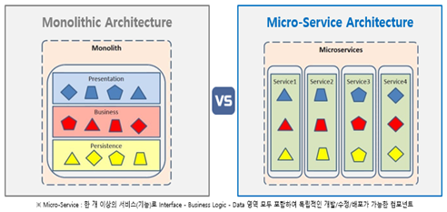

# Monolithic Architecure(MA)와 Micro Service Architecture(MSA)

> MA에서 MSA로의 변화 이유와 구현 방법
     
## Monolithic Architecure(MA)
모놀리식 아키텍처는 애플리케이션의 모든 기능이 하나의 통합된 코드베이스와 단일 애플리케이션으로 구성된 아키텍처이다.     
즉, 사용자 인증, 데이터베이스 접근, 비즈니스 로직 등 모든 기능이 하나의 프로젝트 안에서 실행되며, 하나의 배포 단위로 운영된다는 의미이다.

## Micro Service Architecture(MSA)
### MSA란?
마이크로서비스 아키텍처는 애플리케이션을 여러 개의 독립적인 마이크로서비스로 나누어 개발하고, 각 서비스가 특정 기능을 담당하는 구조이다.   
각 마이크로서비스는 자체 데이터베이스를 갖고 독립적으로 배포할 수 있어 개별 기능을 서로 독립적으로 운영할 수 있다.  

### 등장배경
  

> Monolithic Archtecure의 문제 

모든 기능이 단일 프로젝트 내에서 하나의 패키지로 구성되고, 모든 모듈이 공통 데이터베이스를 사용하여 데이터를 공유하며 함께 배포된다.  
따라서, 특정 기능을 확장하기 위해 일부 코드를 변경하면 전체 애플리케이션을 다시 빌드하고 배포해야 하므로 오류 발생 시 큰 리스크가 있다.  
반면 **MSA**는 서비스 간의 결합도가 낮고 독립적이기 때문에, 특정 기능을 확장하거나 업데이트하기 쉽고, 기능을 서비스 단위로 분리하여 독립적으로 운영하기에 확장성, 유연성, 장애 대응력이 뛰어나다.

## 모놀리식 아키텍처와 MSA의 차이점

| 특성            | 모놀리식 아키텍처                        | MSA (마이크로서비스 아키텍처)                |
|------------------|------------------------------------------|----------------------------------------------|
| **구조**        | 단일 애플리케이션, 모든 기능 통합         | 독립적인 서비스들로 구성                     |
| **배포**        | 통합 배포, 하나의 패키지로 관리           | 각 서비스 개별 배포 가능                     |
| **데이터 관리** | 공통 데이터베이스 사용                    | 각 서비스 별도로 데이터베이스 관리 가능      |
| **확장성**      | 전체 애플리케이션 단위로 확장             | 서비스별 확장 가능                           |
| **장애 대응**   | 전체 시스템에 영향 가능성 있음            | 특정 서비스의 장애가 다른 서비스에 미치지 않음 |
| **유지보수**    | 코드베이스가 커지면 어려움               | 특정 서비스 단위로 유지보수 용이              |
| **통신 방식**   | 내부 호출 (빠름)                          | 네트워크 통신 (추가 비용 발생 가능)           |

## MSA의 장점

## MSA의 단점

## MSA 구조

## 구현을 위해 사용되는 기술

### 요청
    클라이언트 -> API Gateway -> NGINX Ingress -> 쿠버네티스 서비스 -> Pod(마이크로서비스)

API Gateway  
NGINX Ingress  
쿠버네티스 서비스  
마이크로서비스 Pod : 쿠버네티스의 기본 배포 단위로, 하나의 Pod에 컨테이너가 하나 이상 포함됨. 각 마이크로서비스는 하나 이상의 Pod으로 배포될 수 있으며, 쿠버네티스가 트래픽과 상태를 모니터링하여 자동으로 관리함.  

